# ANALISI STRATEGICA: ECCELLENZA PRODUTTIVA VS FRAGILITÀ DIGITALE

## 1. Preparazione e Contesto
**Obiettivo:** Dimostrare dati alla mano che l'eccellenza produttiva del territorio non è supportata da un'adeguata infrastruttura digitale. L'obiettivo è esporre i rischi latenti e offrire la nostra soluzione "chiavi in mano" (Governance + Tech).

---

## 2. Analisi del Territorio (Lato IT)
**Perché condurre questa analisi?**
Per arrivare al tavolo con una fotografia impietosa ma realistica. Il territorio Varesino/Comasco/Ticinese è un'eccellenza manifatturiera, ma spesso si rivela un "gigante dai piedi d'argilla" sul fronte digitale.

### A. I Settori Forti (Meccanica di Precisione, Aeronautica, Tessile, Plastica)
* **Stato attuale:** Macchinari all'avanguardia (spesso interconnessi in logica Industria 4.0 per sgravi fiscali), ma reti interne fragili e non segregate.
* **Strutture IT necessarie:**
    * Sistemi **IoT sicuri** (per evitare il blocco remoto delle CNC).
    * **Cloud ibrido** per la gestione dei big data di produzione.
    * ERP integrati con e-commerce B2B.
* **Il nostro intervento:** *"Governance dei dati industriali"*. Non vendiamo solo il sito web, vendiamo la protezione del loro know-how (brevetti e disegni tecnici) che oggi viaggiano su reti vulnerabili.

### B. I Settori in Transizione (Servizi, Retail locale, Piccola Logistica)
* **Stato attuale:** Digitalizzazione ferma a email base e file Excel disordinati. Siti vetrina obsoleti e non conformi al GDPR.
* **Gap infrastrutturale:** Assenza totale di CRM, assenza di backup ridondanti (regola 3-2-1 ignorata), cybersecurity inesistente (password deboli, no 2FA).
* **Il nostro intervento:** Digitalizzazione dei processi (Web App gestionali su misura) e messa in sicurezza (Vulnerability Assessment base).

### Visualizzazione del Rischio: Supply Chain Attack
Spesso l'imprenditore piccolo pensa di essere "troppo piccolo per essere attaccato". Questo grafico dimostra il contrario: lui è il *ponte* per attaccare i grandi.

```mermaid
%%{init: {'theme': 'dark'}}%%
graph TD
    subgraph ATTACK_VECTOR ["L'ATTACCO ALLA SUPPLY CHAIN"]
        Hacker["Gruppo Ransomware"] 
        
        Target["PMI Varesina<br/>(Fatturato 15M€ - IT Debole)"]
        Victim["Cliente TEDESCO/USA<br/>(Fatturato 10B€ - IT Forte)"]
        
        Hacker -->|"Phishing mirato"| Target
        Target -->|"Invia PDF infetto o<br/>Fattura Manomessa"| Victim
        
        Victim -->|"Blacklist Fornitore"| Target
        
        style Hacker fill:#7f1d1d,stroke:#ef4444,color:#fff
        style Target fill:#f59e0b,stroke:#fff,color:#000
        style Victim fill:#1e3a8a,stroke:#60a5fa,color:#fff
    end
```

## 3. Il Questionario (Data Collection)

### Piattaforma e User Experience
* **Frontend:** Google Form accessibile via **QR Code** (stampato su cavalieri da tavolo personalizzati durante l'evento).
* **Backend:** Google Sheets collegato via API a uno script Python per l'elaborazione in tempo reale.

### Struttura delle Domande (La "Pain Strategy")
Non chiediamo *"Ti piace l'IT?"*, ma poniamo domande che generano consapevolezza del rischio (*Fear of Loss*).

1.  **Infrastruttura:** *"In caso di attacco ransomware oggi, quanto tempo impieghereste a ripristinare l'operatività totale?"*
    * *Opzioni:* Immediato, 24h, 1 settimana, **Non lo so** (Chi risponde 'Non lo so' è il nostro target primario).
2.  **Web & Visibility:** *"Il vostro sito web genera lead qualificati o è solo una vetrina statica? È integrato col vostro gestionale?"*
3.  **Governance:** *"Avete una policy scritta per la gestione delle password e degli accessi ai dati sensibili?"*

## 4. Analisi Dati e Modelli Predittivi (Il Cuore della Presentazione)
Agli imprenditori non interessano i tecnicismi, interessano: **Soldi, Risparmio e Sicurezza**.

### Il Dataset
Creiamo una matrice dove ogni imprenditore è un vettore con caratteristiche:
`[Settore, Fatturato, Maturità_Digitale, Rischio_Cyber, Propensione_Investimento]`

### A. Analisi Descrittiva: Il "Radar Chart" del Gap
Utilizzeremo Python (libreria `matplotlib` o `plotly`) per generare in tempo reale un grafico a radar.

* **Visualizzazione:** Sovrapponiamo la media del mercato globale (Benchmark) con la media dei 20 imprenditori in sala.
* **Obiettivo:** Mostrare visivamente che mentre sulla "Qualità Prodotto" sono al 100%, su "Cybersecurity" e "Web Presence" sono al 20%. Questo gap visivo è un potente driver di vendita.

### B. Modello di Clustering (K-Means Algorithm)
* **Strumento:** Python (`scikit-learn`).
* **Concept:** "L'algoritmo ha analizzato le vostre risposte e vi ha divisi in 3 gruppi":
    * 🔴 **I Vulnerabili:** Rischio alto di chiusura per incidente informatico.
    * 🟡 **Gli Invisibili:** Ottimi prodotti, ma inesistenti sul web (perdita di fatturato potenziale).
    * 🟢 **I Leader Digitali:** (Probabilmente nessuno o pochi, da usare come esempio virtuoso).
* **Messaggio:** *"La nostra associazione vi porta dal gruppo Rosso al gruppo Verde."*

### C. Analisi Predittiva: Monte Carlo Simulation (Semplificata)
* **Modello:** Simulazione del rischio economico a 24 mesi.
* **Input:** Fatturato medio azienda + Probabilità attacco cyber (statistica settore) + Costo fermo macchina.
* **Output:** *"Senza un reparto IT (Governance + Security), c'è una probabilità del X% di perdere Y€ nei prossimi 2 anni."*
* **Scopo:** Spostare la discussione dal "costo della consulenza" al "costo del non agire".

---

## 5. La Strategia "Live Dashboard"
Come analisti esperti, non presentiamo slide statiche di PowerPoint. Dimostriamo la potenza del reparto IT creando una **Web App in tempo reale**.

### Lo Stack Tecnologico
* **Framework:** Streamlit o Dash (Python). Rapidissimi da sviluppare.
* **Connessione:** Script collegato in live-polling al Google Sheet del form.

### L'Effetto WOW
Mentre gli imprenditori compilano il form col QR code, la Web App proiettata sullo schermo si aggiorna in tempo reale. I grafici (torte, istogrammi, radar chart) si animano man mano che arrivano le risposte.

### Perché farlo?
1.  **Competenza:** Dimostri competenza tecnica immediata (*Show, don't tell*).
2.  **Cloud:** Fai vedere che sapete maneggiare i dati in cloud.
3.  **Engagement:** Analizzi il loro dato specifico in diretta, creando un coinvolgimento emotivo impossibile da replicare con slide statiche.

