# ANALISI PROFONDA DEL TERRITORIO (Economic & Digital Intelligence)

## 2.1 Analisi Macro-Economica: Il "Distretto Export" e la Fragilità dei Dati
Varese non è una provincia qualunque; rappresenta uno dei distretti a più alta vocazione Export d'Italia.

==Dato Economico: L'export pro-capite è ai vertici nazionali. Le merci viaggiano accompagnate da flussi di dati critici: bolle doganali, fatture elettroniche, disegni tecnici e brevetti.==

Varese non è una provincia qualunque; rappresenta uno dei distretti a più alta vocazione Export d'Italia, fungendo da "Gateway" economico verso il Nord Europa e il mondo.

### 📊 I Dati Reali (La "Potenza di Fuoco")

Per dare peso a questa affermazione durante la presentazione, dobbiamo citare i volumi che definiscono la criticità del territorio.Volume Export: La provincia di Varese movimenta annualmente merci per un valore che oscilla tra i 10 e i 12 Miliardi di Euro (Fonte: Elaborazioni ISTAT Coeweb / Camera di Commercio Varese).

- Posizionamento: Stabilmente nella Top 10 delle province italiane per export pro-capite.
- Il Ruolo di Malpensa: Essendo sede del primo scalo merci italiano (Cargo City), Varese non solo produce, ma gestisce la logistica di gran parte del Made in Italy.

#### Composizione dell'Export (Settori Critici)
Non esportiamo "cose semplici".Esportiamo ingegneria.
 
 ```mermaid
 %%{init: {'theme': 'dark', 'pie': { 'textPosition': 0.5 } } }%%
    pie title Ripartizione Approssimativa Export Varese (Valore Strategico)
      "Meccanica & Macchinari (High Risk IP)" : 45
      "Tessile & Moda (High Risk Brand)" : 15
     "Chimica & Gomma/Plastica" : 15
     "Mezzi di Trasporto (Aerospace)" : 12
        "Altro" : 13
```

*Insight per l'Analista*: Notate la fetta "Meccanica & Aerospace". Qui non si vendono prodotti a scaffale, si vendono progetti su misura. Se perdi il disegno tecnico (IP), hai perso il vantaggio competitivo per sempre.

---

### 🔗 Il Concetto di "Digital Twin" (L'Ombra Digitale)

L'affermazione "Le merci viaggiano accompagnate da flussi di dati" va esplosa tecnicamente. Ogni container fisico che lascia Varese ha un "gemello digitale" che viaggia sulla rete. Se il gemello digitale si blocca, il container si ferma.


---

### Tabella di Rischio: La Metamorfosi del Pericolo

| Asset Fisico (La Merce) | Asset Digitale Correlato | Minaccia Cyber Rilevata | Impatto Operativo Immediato |
| :--- | :--- | :--- | :--- |
| **Macchinario Industriale** | Disegni Tecnici, Brevetti, File PLC | **Spionaggio Industriale / Exfiltration** | Il concorrente estero replica il macchinario in 6 mesi a metà prezzo. |
| **Container in Uscita** | Bolla Doganale, Packing List Digitale | **Ransomware su Logistica** | La merce resta ferma in dogana a Malpensa/Genova. Penali per ritardata consegna. |
| **Componente Aerospaziale** | Certificazione Qualità & Safety (PDF/XML) | **Data Tampering (Manomissione)** | Ritiro della fornitura da parte del committente (es. Boeing/Leonardo) per "non conformità di sicurezza". |
| **Fatturato Export** | Fatture Elettroniche, Coordinate Bancarie | **BEC (Business Email Compromise)** | L'hacker intercetta la fattura e cambia l'IBAN. Il cliente paga 200k€ sul conto dell'hacker. |

```mermaid
%%{init: {'theme': 'dark'}}%%
graph TD
    subgraph ATTACK_VECTOR ["L'ATTACCO ALLA SUPPLY CHAIN"]
        Hacker["Gruppo Ransomware"] 
        
        Target["PMI Varesina<br/>(Fatturato 15M€ - IT Debole)"]
        Victim["Cliente TEDESCO/USA<br/>(Fatturato 10B€ - IT Forte)"]
        
        Hacker -->|"Phishing mirato"| Target
        Target -->|"Invia PDF infetto o<br/>Fattura Manomessa"| Victim
        
        Victim -->|"Blacklist Fornitore"| Target
        
        style Hacker fill:#7f1d1d,stroke:#ef4444,color:#fff
        style Target fill:#f59e0b,stroke:#fff,color:#000
        style Victim fill:#1e3a8a,stroke:#60a5fa,color:#fff
    end
```


Sintesi del Dato per l'Imprenditore"Direttore, lei non sta proteggendo solo dei computer. Lei sta proteggendo 12 Miliardi di Euro di credibilità territoriale. Se i dati delle nostre bolle doganali si fermano, si ferma l'economia della provincia, non solo il suo server."

*L'Analisi da Presentare*
Interconnessione: Le aziende varesine non sono compartimenti stagni. Operano come subfornitori strategici (Tier-2 o Tier-3) per colossi globali.

**Il Punto Dolente (Pain Point)**: Il rischio di esclusione dalla supply chain per mancanza di compliance IT.


La nostra leva strategica: "Se non adeguate la vostra governance IT, il blocco arriverà a cascata dalla Germania o dagli USA. Non sarete tagliati fuori per la qualità del prodotto, ma per il 'rischio informatico indotto'."

## 2.2 Analisi Settoriale Verticale (Cluster Analysis)
Non possiamo trattare tutte le aziende allo stesso modo. Abbiamo segmentato il territorio in 3 Cluster Critici.

```mermaid
%%{init: {'theme': 'dark'}}%%
mindmap
  root((Territorio<br/>Varese))
    Cluster A: Metal Valley
      ::icon(fa fa-cogs)
      Caratteristiche
        Alto Valore Aggiunto
        Disegni CAD/CAM
      Minaccia
        Spionaggio Industriale
        Furto IP
      Soluzione
        Cloud Privati Criptati
        DLP (Data Loss Prevention)
    Cluster B: Logistica/Gomma
      ::icon(fa fa-truck)
      Caratteristiche
        Bassi Margini
        Volumi Alti
      Minaccia
        Business Continuity
        Excel corrotti
      Soluzione
        Web App Custom
        Ridondanza Server
    Cluster C: Tessile/Moda
      ::icon(fa fa-tshirt)
      Caratteristiche
        Brand Reputation
        Stagionalità
      Minaccia
        Contraffazione
        UX Scadente
      Soluzione
        Restyling UX/UI
        Analytics Trend
```




Dettaglio Operativo dei Cluster

CLUSTER A (Metal Valley): Il valore è nel file di progetto. Necessaria protezione contro l'esfiltrazione dati via USB.

CLUSTER B (Logistica): Un fermo di 4 ore causa penali enormi. Necessaria eliminazione di Excel a favore di database strutturati.

CLUSTER C (Fashion): Il danno è reputazionale. Necessario un e-commerce scalabile e difeso.

2.3 Il "Fattore Svizzera": Analisi della Competitività HR
Il tasto dolente: la fuga di cervelli verso il Canton Ticino.

Dato di fatto: Impossibile competere sul netto in busta paga.

L'Analisi Strategica: Spostare la competizione dal salario allo stile di vita lavorativo (Work-Life Balance & Tech Stack).

```mermaid
%%{init: {'theme': 'dark'}}%%
graph TD
    Talento[Ing. Informatico / Dev]
    
    CH[SVIZZERA]
    VA[AZIENDA VARESE]
    
    Talento -->|Scelta Stipendio| CH
    Talento -->|Scelta Welfare & Tech| VA
    
    CH --- Salary[$$$ Stipendio Doppio]
    CH --- Commute[Pendolarismo / Rigidità]
    
    VA --- Flex[Smart Working Reale]
    VA --- Stack[Tech Stack Moderno]
    VA --- Growth[Crescita per Obiettivi]
    
    style CH fill:#eee,stroke:#333
    style VA fill:#d4f1f4,stroke:#333,stroke-width:4px
```




La Tesi: "Non potete raddoppiare gli stipendi, ma potete offrire un'azienda dove non si timbra il cartellino marrone ma si usano piattaforme collaborative avanzate."

## 2.4 Analisi della "Superficie d'Attacco" e ROI
Spostamento del target dagli istituti bancari alle PMI manifatturiere.

Il Paradosso di Varese (Visual Data Storytelling)
Durante la Round Table, useremo questo grafico per mostrare che le aziende sono "Giganti Economici ma Nani Digitali".


Il Calcolo del ROI (Return on Investment)
Confronto tra lo scenario reattivo (pagare i danni) e lo scenario proattivo (nostra consulenza).


Messaggio: Il costo della prevenzione è una frazione del costo di un singolo incidente di fermo produzione.# ANALISI PROFONDA DEL TERRITORIO (Economic & Digital Intelligence)

## 2.1 Analisi Macro-Economica: Il "Distretto Export" e la Fragilità dei Dati
Varese non è una provincia qualunque, è uno dei distretti a più alta vocazione Export d'Italia.

Dato Economico: La provincia di Varese ha un export pro-capite tra i più alti in Italia. Le merci viaggiano, e con esse viaggiano bolle doganali, fatture elettroniche, disegni tecnici e brevetti.

L'Analisi da presentare:

Interconnessione: Le aziende varesine non lavorano a compartimenti stagni. Sono spesso subfornitori (Tier-2 o Tier-3) di colossi (es. Leonardo per l'aerospazio o grandi player automotive tedeschi).

Il Punto Dolente (Pain Point): Le grandi capofile internazionali stanno iniziando a richiedere certificazioni di sicurezza informatica (ISO 27001, TISAX) ai loro fornitori.

La nostra leva: "Se non adeguate la vostra governance IT e la sicurezza dei dati, rischiate di essere tagliati fuori dalla Supply Chain tedesca o americana nei prossimi 3 anni, non per qualità del prodotto, ma per 'rischio informatico indotto'."

---

## 2.2 Analisi Settoriale Verticale (Cluster Analysis)

Non trattiamo tutti allo stesso modo. Dividiamo il territorio in 3 Cluster critici basati sui dati della Camera di Commercio.

   - CLUSTER A: The "Metal Valley" (Meccanica, Aeronautica, Utensileria)

    Caratteristiche: Alto valore aggiunto, brevetti, disegni CAD/CAM proprietari.

        Analisi del Rischio: Il loro valore non è nel macchinario, è nel file del progetto.

        Minaccia rilevata: Spionaggio industriale e Ransomware mirato.

        Soluzione IT: Non serve un "sito web", servono Cloud privati criptati e sistemi di Data Loss Prevention (DLP) per impedire che un dipendente esca con una chiavetta USB piena di progetti.

  -  CLUSTER B: Logistica e Gomma-Plastica (Area Malpensa/Busto)

    Caratteristiche: Bassi margini, alti volumi, necessità di velocità estrema.

        Analisi del Rischio: Un fermo dei sistemi di 4 ore causa un blocco dei camion e penali contrattuali enormi.

        Minaccia rilevata: Business Continuity inesistente. Spesso usano fogli Excel condivisi che si corrompono o sovrascrivono.

        Soluzione IT: Sviluppo di Web App gestionali custom (Python/Django) per tracciamento real-time e eliminazione della carta/Excel, con ridondanza dei server.

  -  CLUSTER C: Il Tessile/Moda di Nicchia (Gallarate/Como)
    
        Caratteristiche: Brand reputation, e-commerce, stagionalità.

        Analisi del Rischio: Contraffazione del marchio e scarsa visibilità sui mercati esteri emergenti.

        Minaccia rilevata: Siti web vetusti, non indicizzati (SEO assente), esperienza utente (UX) che danneggia il brand.

        Soluzione IT: Restyling UX/UI aggressivo, E-commerce scalabili, algoritmi di analisi dei trend sui social.

---

## 2.3 Il "Fattore Svizzera": Analisi della Competitività HR

Questo è il tasto dolente di ogni imprenditore varesino: i frontalieri.

Dato di fatto: Un'azienda di Varese fatica ad assumere talenti IT o ingegneri perché il Canton Ticino offre stipendi doppi.

L'Analisi Strategica: L'imprenditore non può competere sul salario netto. Deve competere sul Welfare e sulla Flessibilità.

Il ruolo dell'IT:

Presentiamo dati su come un'infrastruttura IT moderna permetta lo Smart Working reale (non solo "lavoro da casa", ma collaborazione in cloud fluida).

Tesi: "Volete trattenere i giovani talenti senza raddoppiare gli stipendi? Dovete offrirgli un'azienda digitalmente evoluta, dove non si timbra il cartellino marrone ma si lavora per obiettivi su piattaforme collaborative avanzate. Noi vi costruiamo questa infrastruttura."

---

## 2.4 Analisi della "Superficie d'Attacco" del Territorio

Come analista cyber, porti dati presi (o simulati realisticamente) da report tipo CLUSIT.

Grafico Trend: Mostra come gli attacchi informatici nel Nord Italia non colpiscano più le banche (troppo protette), ma le PMI manifatturiere (ricche e poco protette).

Il Calcolo del ROI:

Costo medio di un riscatto ransomware: 50.000€ - 200.000€.

Costo medio di fermo produzione: 10.000€/giorno.

Costo della nostra consulenza annuale: (X cifra molto inferiore).

Messaggio: La nostra consulenza non è un costo, è una polizza assicurativa attiva.

Come presentare questi dati (Visual Data Storytelling)
Per rendere questa analisi "vera" e non chiacchiere, suggerisco di usare queste visualizzazioni durante la Round Table:

Heatmap Geografica (Lombardia): *

Colorare le zone industriali (Varese/Como/Brianza) in rosso intenso per indicare "Alta Densità di Dati Sensibili a Rischio".

Grafico a Dispersione (Scatter Plot) - "Efficienza vs Sicurezza":

Asse X: Fatturato/Dipendente (Efficienza produttiva -> Varese è alta).

Asse Y: Spending in IT Security (Sicurezza -> Varese è bassa).

Risultato: Mostra visivamente che sono giganti economici ma nani digitali.

Il "Funnel della Perdita Dati":

Un grafico che mostra come un dato non governato (es. un ordine cliente) si perde nei passaggi tra email, carta ed Excel, costando all'azienda il 15% di efficienza annua.